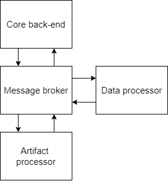
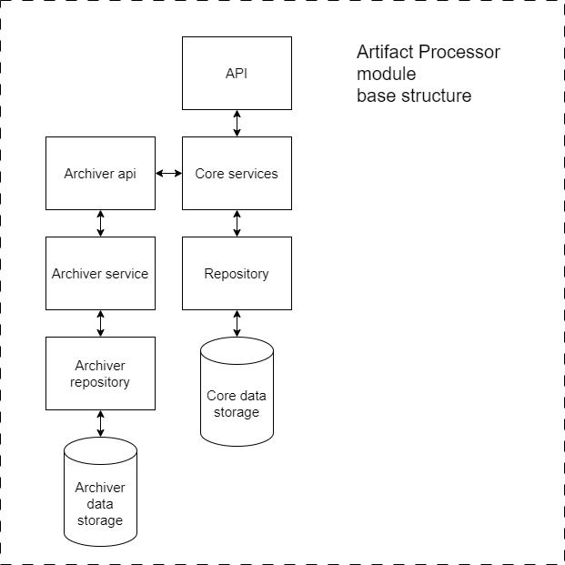
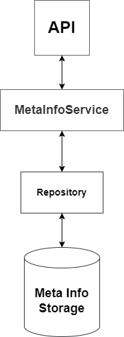
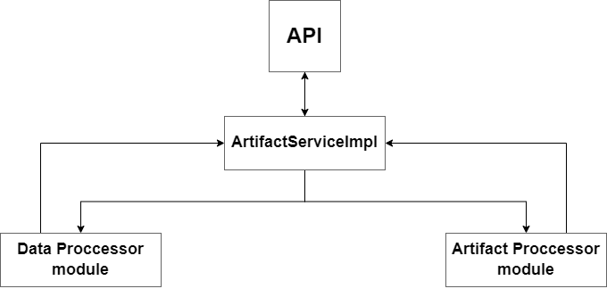

# SaaS project - cloud artifacts storage


## Stack: java 17, spring boot 3.x

## Documentation:

### Application ports:

1. core application - 8080
2. data application - 8083
3. keycloak - 9990
4. kafka - 9092

### Base structure



---

## 1. Artifact Processor

### Base Structure



The Artifact Processor includes core data storage and Archiver data storage modules. In the alpha version, this is a simple in-memory storage (e.g., using a Map).

In the first beta version, we will implement either [Riak KV](https://riak.com/products/integrations/) or Apache Cassandra for more robust storage solutions.

---

## 2. Data Processor

### Base Structure



The Data Processor module is responsible for handling artifact meta-information.

---

## 3. Core Backend

### Base Structure



Core Backend is the module that the user interacts with to add artifacts. It sends requests via Kafka to other modules and, after receiving the results, executes them.

## Open API

### REST API `api/v1/artifacts`

#### Upload Artifact
```http
POST /upload
```
- **Request Body**: `ArtifactCreateRequest`.
```java
public class ArtifactCreateRequest {
    private String name;
    private byte[] artifactBody;
  ...
}
```
- **Response**: `ArtifactResponse` containing details of the created artifact.

#### Load Artifact
```http
GET /loadArtifact/{id}
```
- **Path Parameters**:
  - `id` - externalId of the artifact to be loaded.
- **Response**: `ArtifactLoadResponse` containing the details of the requested artifact.

#### Delete Artifact
```http
DELETE /deleteArtifact/{id}
```
- **Path Parameters**:
  - `id` - externalId of the artifact to be deleted.
- **Response**: boolean (indicates if the deletion was successful).